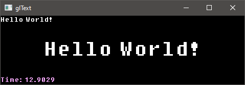

# glText

[![Build Status][glTextBuildStatus]][glTextCI]
![Release][glTextVersionBadge]
![Supported OpenGL 3.3][glTextOpenGLVersionsBadge]
![License][glTextLicenseBadge]

[glText][glText] is a simple cross-platform single header text rendering
library for OpenGL. [glText][glText] requires no additional files
(such as fonts or textures) for drawing text, everything comes pre-packed
in the header.

<p align="center">
  
</p>

*The above screenshot is of the [simple.c](examples/simple.c) example.*

## Example

```c
// Initialize glText
gltInit();

// Creating text
GLTtext *text = gltCreateText();
gltSetText(text, "Hello World!");

// Begin text drawing (this for instance calls glUseProgram)
gltBeginDraw();

// Draw any amount of text between begin and end
gltColor(1.0f, 1.0f, 1.0f, 1.0f);
gltDrawText2D(text, x, y, scale);

// Finish drawing text
gltEndDraw();

// Deleting text
gltDeleteText(text);

// Destroy glText
gltTerminate();
```


## Implementation

In one C or C++ file, define `GLT_IMPLEMENTATION` prior to inclusion to create the implementation.

```c
#define GLT_IMPLEMENTATION
#include "gltext.h"
```


## Optimization

Each time `gltDraw*()` functions are called, `glGetIntegerv(GL_VIEWPORT, ...)`
is called. To avoid this and optimize that call away, define `GLT_MANUAL_VIEWPORT`
before including `gltext.h`.

```c
#define GLT_MANUAL_VIEWPORT
#include "gltext.h"
```

Then when the viewport is resized manually call:

```c
gltViewport(width, height)
```


## Manual Model, View, Projection Matrix

The example uses [LinearAlgebra](https://github.com/vallentin/LinearAlgebra).

```c
GLfloat fontScale = 0.01f;

GLfloat x = 0.0f;
GLfloat y = 0.0f;

x -= gltGetTextWidth(text, fontScale) * 0.5f;
y -= gltGetTextHeight(text, fontScale) * 0.5f;

mat4 proj = mat4::perspective(70.0f, viewportWidth, viewportHeight, 0.1f, 10.0f);

mat4 view = ...;

mat4 model = mat4::identity;
model.translate(x, y + gltGetTextHeight(text, fontScale));
model.scale(fontScale, -fontScale);

mat4 mvp = proj * view * model;

gltDrawText(text, (GLfloat*)&mvp);
```


## Aligned Text

```c
// Where horizontal is either:
// - GLT_LEFT (default)
// - GLT_CENTER
// - GLT_RIGHT

// Where vertical is either:
// - GLT_TOP (default)
// - GLT_CENTER
// - GLT_BOTTOM

gltDrawText2DAligned(text, x, y, scale, horizontal, vertical);
```


## No Dependencies

[glText][glText] has no external dependencies besides [OpenGL][OpenGL] and the standard C libraries.
By default [glText][glText] uses `stdlib.h`, `string.h` and `stdint.h`.

If `GLT_DEBUG` is defined `assert.h` is needed. If `GLT_DEBUG_PRINT` is defined `stdio.h` is needed.


## Reporting Bugs & Requests

Feel free to use the [issue tracker][glTextIssues],
for reporting bugs, submitting patches or requesting features.

Before submitting bugs, make sure that you're using the latest version of [glText][glText].


[glText]: https://github.com/vallentin/glText

[glTextReleases]: https://github.com/vallentin/glText/releases

[glTextBuildStatus]: https://drone.io/github.com/vallentin/glText/status.png
[glTextCI]: https://drone.io/github.com/vallentin/glText/latest

[glTextVersionBadge]: https://img.shields.io/badge/release-v1.1.6-blue.svg
[glTextLicenseBadge]: https://img.shields.io/badge/license-%20free%20to%20use%2C%20share%2C%20modify%20and%20redistribute-blue.svg

[glTextOpenGLVersionsBadge]: https://img.shields.io/badge/OpenGL-3.3-blue.svg

[glTextIssues]: https://github.com/vallentin/glText/issues

[OpenGL]: https://en.wikipedia.org/wiki/OpenGL
